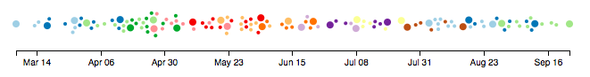
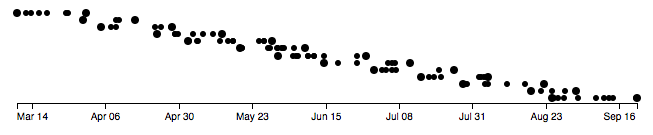
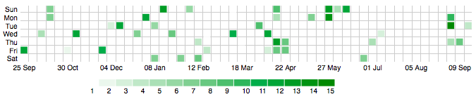

# Timeline Visualizations
## Visualizations of time lines using D3.js

The idea here is to explore different visualizations of groups of data points along a time line.  There's a data generator to allow this to be standalone. The data is in groups with potentially overlapping timelines of their own.  The visualization should:

* show when the various events occurred (or will occur) relative to one another along a timeline axis increasing left to right
* distinguish between the groups to which each event belongs
* show the start/earliest and end/latest events in each group
* have a minimalist representation similar to a sparkline

Events only belong to one group.  There are no events in a group earlier than the event tagged as `START` and none are later than the event tagged as `END`.

#### Sample data structure
The sample data is expressed as JSON with a single element called `activities`.  The value for this is an array of objects.  Each object represents a single event with the following structure:

 * `created`: timestamp expressed as milliseconds since epoch start
 * `id`: unique integer for each event
 * `familyId`: integer representing the group 'owning' this event
 * `type`: string of < START, MID, END >

### Random-ish data
Use Node.js to run the gen-data.js script to generate a JSON file of data we can use to explore the visualizations.  Some sample data files are in this project.  

### Beeswarm
------------

Based on Mike Rostock's [original Beeswarm] (http://bl.ocks.org/mbostock/6526445e2b44303eebf21da3b6627320 "original Beeswarm") dated July 4, 2016.  This visualization retains the use of force layout but changes to a timeline axis, uses color for groups and changes the circle radius for the terminal events in a group. Now the circles use a fill color, the hover highlight changed from fill to stroke.  The circle outline change to red is more subtle than in Mike's original.

There are some alternative renderings which may improve this visualization:

* create additional circles for terminal events to give appearance of donuts with the start event having a white center and the end event solid black. This is similar convention to UML state diagrams and would be familar to some
* use semi-circles, left for start, right for end, to act like bookends on the rendered data for a single event group
* use different shaped icons for terminal events instead of circles for every event 
* draw lines connecting the events in a group/family
* introduce brush/zoom facility to allow closer inspection high event density

### Scatter
-----------

Each event group is assigned its own horizontal row to separate the circles. Depending on the exact timeline there is potential for the circles respresenting the events to overlap.

First revision is to change the icons for start and end events in a group.  To reduce risk of collision, rotate 'later' event groups to 'higher' rows. 

### Activity
-----------

Inspired by github's own annual activity table on the the profile page and Swizec Teller's work at https://swizec.com/blog/quick-scatterplot-tutorial-for-d3-js/swizec/5337.  This is a compact way to review activity over a year of data. A legend is included for the color scale and mouse event interactity which dims all activity tiles which have different value to that represented by the legend value under the mouse.

Lots of To Do items here.  This is fairly fragile and more of a work in progress than the other samples on this page.

### Sample data generation
Use Node.js to run gen-activity-data.js which will generate a JSON file of data for activity counts.  One sample of a generated file is included `activity.json`. Structure of this file is:

* `user`: Name of the user who generated this activity count
* `activities`: An array of objects with the following structure:
  * `when`: timestamp as milliseconds since epoch start
  * `size`: integer for the number of activities

